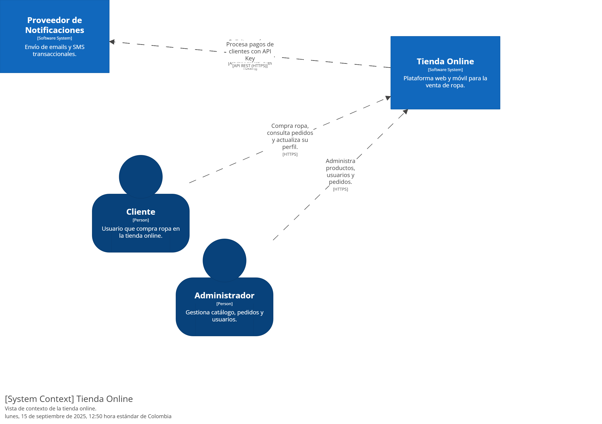
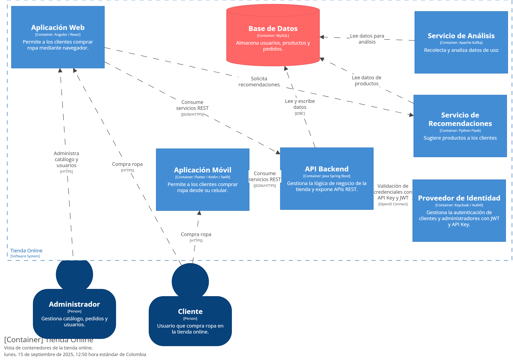
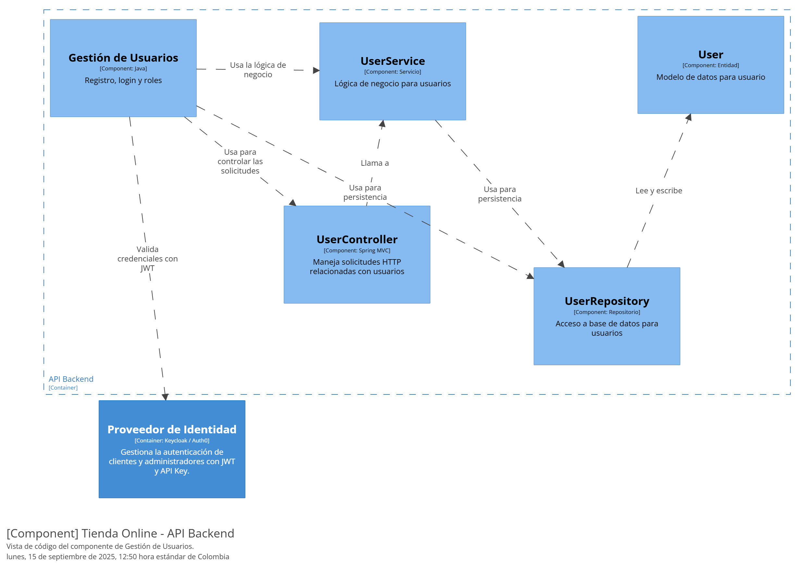

Markdown

# Tienda Online de Ropa - Modelo C4 con Structurizr

## Descripción del Proyecto

Este repositorio contiene la arquitectura de una tienda online de ropa modelada con el **Modelo C4**. Los diagramas se generan automáticamente a partir de código Java usando la biblioteca **Structurizr** y se suben a una cuenta en la nube.

El modelo incluye los siguientes niveles de vista, que se pueden ver en los diagramas a continuación:
* **Diagrama de Contexto (C1)**: Muestra el sistema y su entorno.
* **Diagrama de Contenedores (C2)**: Detalla las aplicaciones y la base de datos dentro del sistema.
* **Diagrama de Componentes (C3)**: Profundiza en la estructura interna de un contenedor específico, como el Servicio de Recomendaciones.
* **Diagrama de Código (C4)**: Muestra la estructura de clases del componente de Gestión de Usuarios.

---

## Diagramas de Arquitectura

Estos diagramas han sido exportados de Structurizr y se incluyen como imágenes para su visualización directa en este repositorio.

### 1. Diagrama de Contexto (C1)

### 2. Diagrama de Contenedores (C2)

### 3. Diagrama de Componentes (C3)

### 4. Diagrama de Código (C4)

---

## Estructura del Repositorio

La estructura del proyecto sigue un formato estándar de **Maven** para Java, con una carpeta dedicada a los diagramas.

TIENDA-ONLINE-STRUCTURIZR/
- assets/
    - diagrams/
        - structurizr-106127-Contexto.png
        - structurizr-106127-Contenedores.png
        - structurizr-106127-Componentes.png
        - structurizr-106127-Codigo - Gestion de Usuarios.png
- src/
    - main/
        - java/
            - com/
                - example/
                    - TiendaOnlineRopaPlantilla.java
- target/
    - (archivos generados)
- pom.xml
- tiendaOnlinePlantilla.puml

---

## Cómo Ejecutar el Proyecto

Para generar estos diagramas y subirlos a tu propio espacio de trabajo de Structurizr, sigue estos pasos:

1.  **Clona este repositorio:**git clone https://github.com/Libardo123/tienda-online-structurizr.git
2.  **Configura tus credenciales:** Abre el archivo `TiendaOnlineRopaPlantilla.java` y reemplaza el `workspaceld`, `apiKey` y `apiSecret` con los de tu cuenta de Structurizr Cloud.
3.  **Ejecuta el código:** Compila y ejecuta la clase principal usando la línea de comandos de Maven:
    `mvn clean compile exec:java -Dexec.mainClass="com.example.TiendaOnlineRopaPlantill
